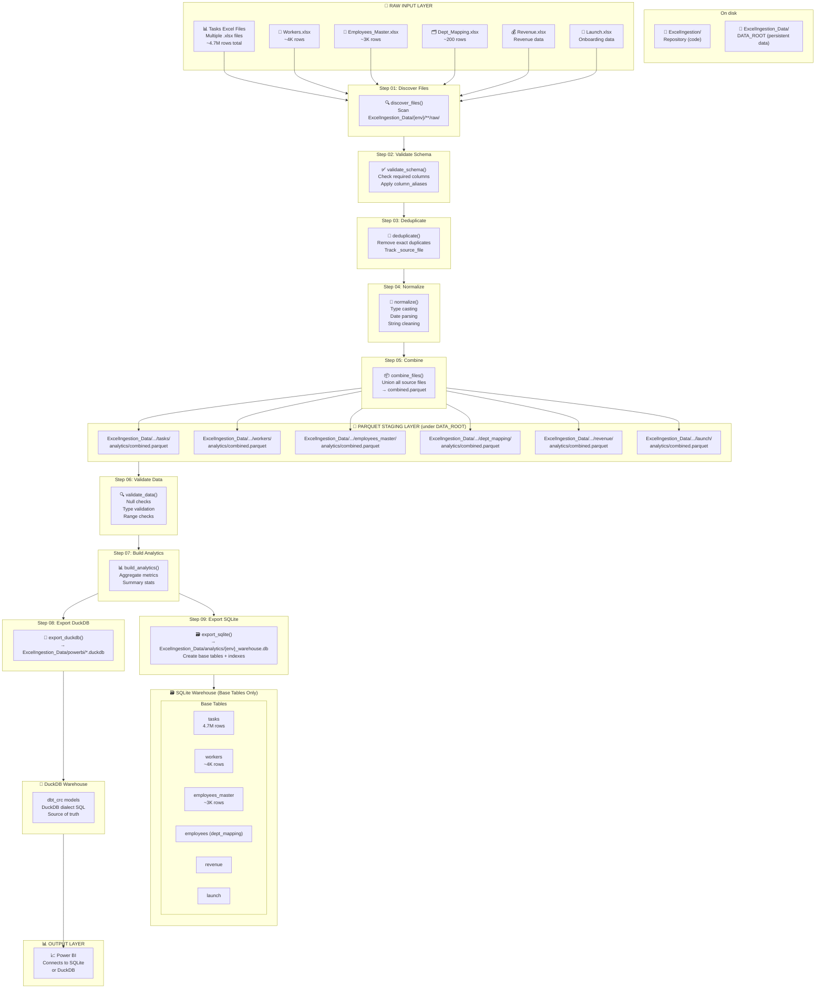
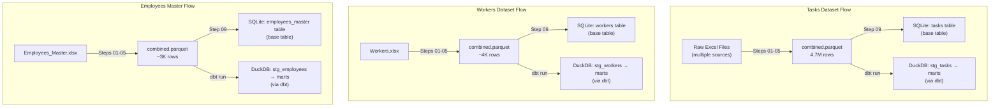
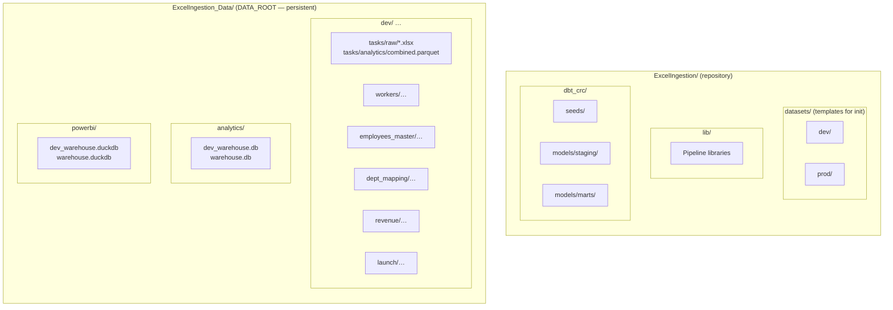
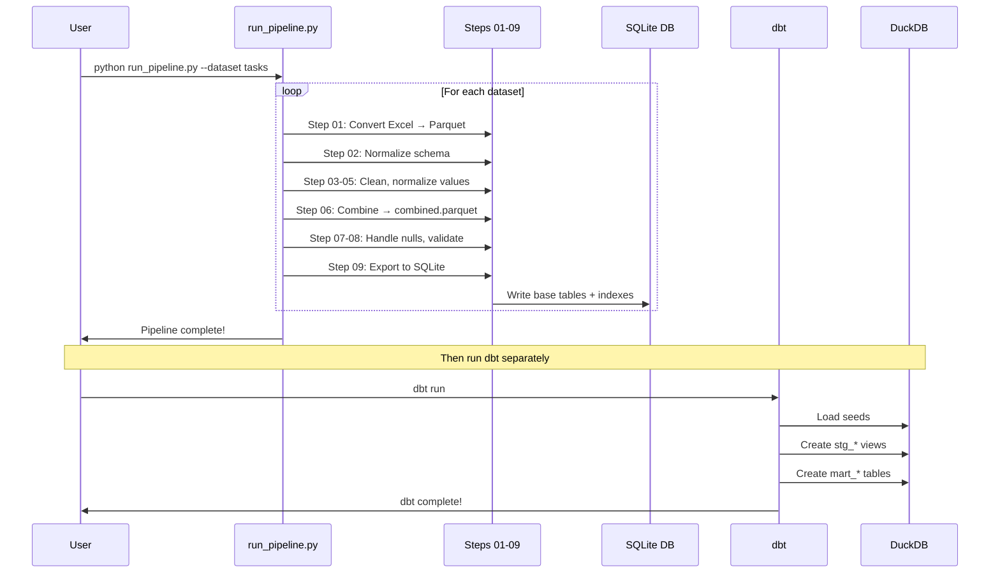
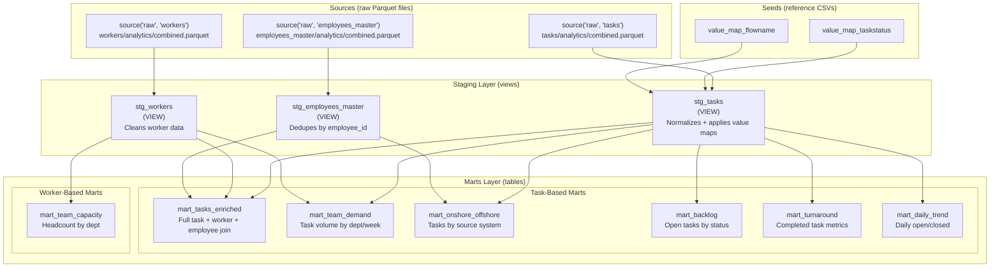
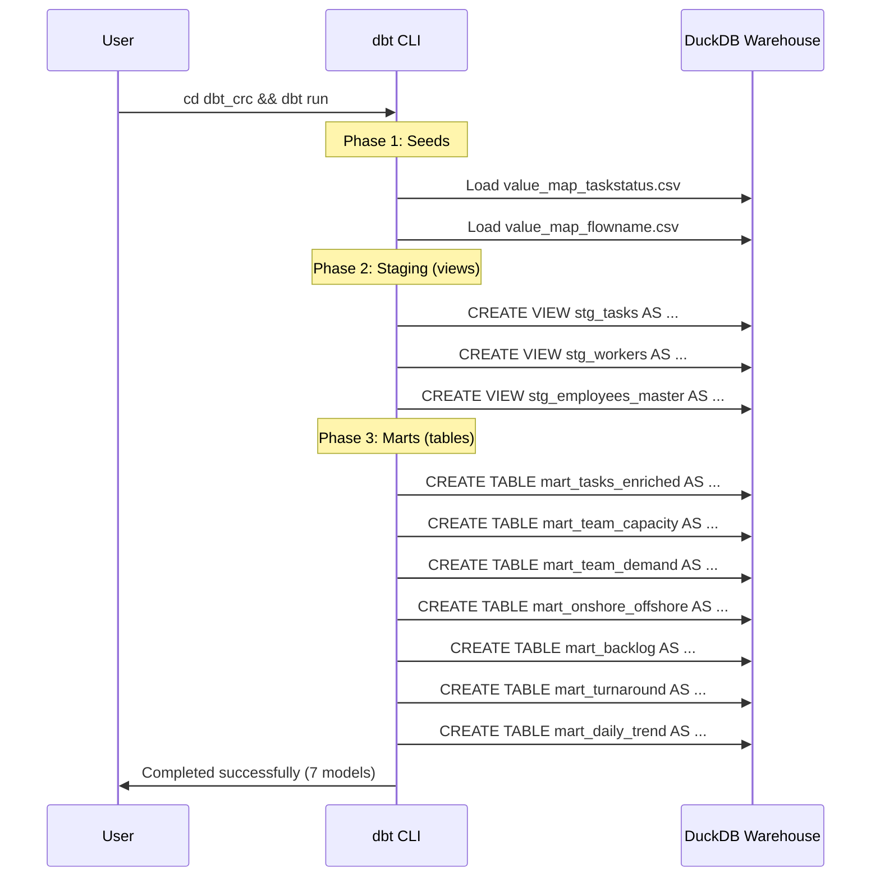

# ExcelIngestion Pipeline - Data Flow Visualization

**Layout:** **`ExcelIngestion/`** holds code (git). **`ExcelIngestion_Data/`** is the default **`DATA_ROOT`**: Excel, Parquet, SQLite, and DuckDB live here so they are not overwritten by repo updates. Set **`DATA_ROOT`** to override the folder name or location.

## Complete Pipeline Architecture



## Dataset Processing Flow



## File System Structure



## Pipeline Execution Order



---

## dbt Model Lineage (DAG)

This shows the dependency graph of your dbt models - what `{{ ref() }}` and `{{ source() }}` create:



## dbt Execution Flow



## dbt Model Details

| Model | Type | Dependencies | Description |
|-------|------|--------------|-------------|
| **stg_tasks** | view | source.tasks, seeds | Normalize assignedto, apply value maps |
| **stg_workers** | view | source.workers | Clean emails, pass through columns |
| **stg_employees_master** | view | source.employees_master | Dedupe by employee_id (latest wins) |
| **mart_tasks_enriched** | table | stg_tasks, stg_workers, stg_employees_master | Full denormalized task fact |
| **mart_team_capacity** | table | stg_workers | Headcount/FTE by cost center |
| **mart_team_demand** | table | stg_tasks, stg_workers | Task volume by department |
| **mart_onshore_offshore** | table | stg_tasks, stg_employees_master | Tasks by source_system |
| **mart_backlog** | table | stg_tasks | Open tasks aging |
| **mart_turnaround** | table | stg_tasks | Completed task handle time |
| **mart_daily_trend** | table | stg_tasks | Daily open/closed trend |

## How to Run dbt

**Important**: dbt requires Python 3.12, not the main venv's Python 3.14. Use the separate `.venv-dbt` environment.

```bash
# Activate dbt venv first (NOT the main .venv)
.venv-dbt\Scripts\activate

# Navigate to dbt project
cd "c:\Users\quang\CRC Code\ExcelIngestion\dbt_crc"

# First time only: install dependencies
dbt deps

# Run all models (seeds -> staging -> marts)
dbt run

# Or run specific parts:
dbt seed                      # Load CSVs only
dbt run --select staging      # Staging views only
dbt run --select marts        # Mart tables only
dbt run --select +mart_tasks_enriched  # mart + all upstream deps

# Generate and view documentation (interactive DAG!)
dbt docs generate
dbt docs serve    # Opens browser at localhost:8080
```

### Two Virtual Environments

| venv | Python | Purpose |
|------|--------|---------|
| `.venv` | 3.14 | Main pipeline (`run_pipeline.py`) |
| `.venv-dbt` | 3.12 | dbt models (`dbt run`, `dbt test`) |

## Tools to Visualize dbt

| Tool | How to Use | Best For |
|------|------------|----------|
| **dbt docs serve** | `dbt docs generate && dbt docs serve` | Official interactive DAG |
| **VS Code: dbt Power User** | Install from marketplace | In-editor navigation |
| **VS Code: vscode-dbt** | Install from marketplace | Syntax highlighting |
| **dbt Cloud** | cloud.getdbt.com | CI/CD + visual IDE |
| **Elementary** | `pip install elementary-data` | Data observability |
| **Mermaid in Markdown** | This file! | Quick static diagrams |

---

## How to View This Diagram

1. **VS Code**: Install the "Markdown Preview Mermaid Support" extension
2. **GitHub**: Renders automatically in .md files
3. **Online**: Paste into [mermaid.live](https://mermaid.live)

## Architecture Summary

| Layer | Location | Contents |
|-------|----------|----------|
| Pipeline (01-09) | Python | Excel → Parquet → SQLite (base tables) |
| dbt | DuckDB | stg_* views + mart_* tables |
| Power BI | DuckDB | Reads from dbt marts |

SQLite contains only base tables. All staging views and marts are in DuckDB via dbt.
